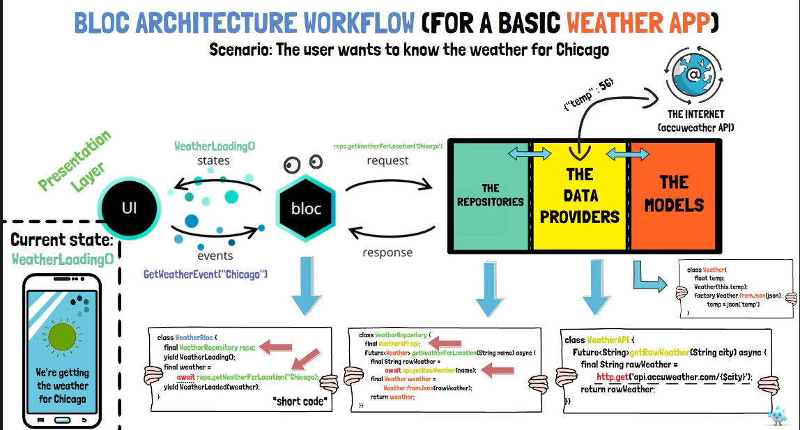

> Flutter Bloc State Management

- [Bloc Concepts](#bloc-concepts)


# Blocs example folder strucuture

- [Simple Cubit example](lib/bloc/example_1_cubit/bloc_example_1.dart)
- [Bloc example 1](lib/bloc/example_2_bloc/bloc_example_2.dart)
  - Testing of this can be found [here](test/bloc/example_2_bloc/bloc/persons_bloc_test.dart)
  - An example of enhanced enum
    ```dart
    enum PersonUrl {
      person1('person1'),
      person2('person2');

      final String name;
      const PersonUrl(this.name);

      String get urlString {
        switch (this) {
          case PersonUrl.person1:
            return 'https://mocki.io/v1/94cf5c4d-cc1e-4cf7-b954-c76dd9472020';
          case PersonUrl.person2:
            return 'https://mocki.io/v1/05bbe37d-937e-425e-b383-6e3f0de60095';
        }
      }
    }
    ```
- [Bloc example 2](lib/bloc/example_3_bloc_notes_app/bloc_example_3_notes_app.dart)
  - this one is using flutter_hooks to make it easier to create TextEditingControllers
  - Equality for app state is important for tests
- [Bloc example 3](lib/bloc/example_4_multi_bloc_provider/example_4_multi_bloc_provider.dart) with Multiprovider


# Bloc

- BlocBuilder
  - buildWhen: only rebuilds UI when condition evaluates to true

# Dependencies

```bash
flutter pub add bloc
flutter pub add flutter_bloc

# for testing
flutter pub add --dev bloc_test
```

### Pods issues

```bash
cd ios

# to remote all dependencies from the iOS application
pod deintegrate 

pod install --repo-update
```

Rebuilding the project

```bash
flutter clean
pod install
flutter pub get
flutter run
```

# Firebase rules

## Storage
- Allow user to modify anything inside _userId_ folder
```js
rules_version = '2';
service firebase.storage = {
  match /b/{bucket}/o {

    function isFolderOwner(userId) {
      // making sure the user is authenticated and matches the id
      return request.auth != null && request.auth.uid == userId;
    }

    match /{userId}/{allPaths=**}
      allow create, read, update, write: if isFolderOwner(userId); 
      // allow read, write: if false; 
  }
}
```

## Bloc and Firebase

- [Managing auth errors](https://github.com/vandadnp/youtube-course-bloc/blob/main/lib/auth/auth_error.dart)
  - this implements a base error class and the messages and error will be displayed in a dialog to the user
  - all the firebase auth errors can be found [here](https://firebase.google.com/docs/auth/admin/errors)


- Usually start with the events that are going to be sent, then the state and finally, the bloc
  - [events](https://github.com/vandadnp/youtube-course-bloc/blob/main/lib/bloc/app_event.dart)
  - [state](https://github.com/vandadnp/youtube-course-bloc/blob/main/lib/bloc/app_state.dart)
  - app [bloc](https://github.com/vandadnp/youtube-course-bloc/blob/main/lib/bloc/app_bloc.dart)
    - handling event for [image upload](https://github.com/vandadnp/youtube-course-bloc/blob/main/lib/bloc/app_bloc.dart#L212)
  - the general dialog used can be found [here](https://github.com/vandadnp/youtube-course-bloc/blob/main/lib/dialogs/generic_dialog.dart)
    - this is the base for the other dialogs, such as [delete account dialog](https://github.com/vandadnp/youtube-course-bloc/blob/main/lib/dialogs/delete_account_dialog.dart), [logout dialoag](https://github.com/vandadnp/youtube-course-bloc/blob/main/lib/dialogs/logout_dialog.dart), and so on.
- a way to pre-populate the text fields if in debugging mode s shown [by the extension here](https://github.com/vandadnp/youtube-course-bloc/blob/main/lib/extensions/if_debugging.dart)
  - it returns the exact same string if debugging, otherwise, returns _null_.
- a generic loading screen overlay can be found [here](https://github.com/vandadnp/youtube-course-bloc/blob/main/lib/loading/loading_screen.dart)
- views
  - [login view](https://github.com/vandadnp/youtube-course-bloc/blob/main/lib/views/login_view.dart) using Flutter Hooks
  - [pop up menu](https://github.com/vandadnp/youtube-course-bloc/blob/main/lib/views/main_popup_menu_button.dart) with log out and delete account options
  - to display each [image box](https://github.com/vandadnp/youtube-course-bloc/blob/main/lib/views/storage_image_view.dart)
  - [image gallery view](https://github.com/vandadnp/youtube-course-bloc/blob/main/lib/views/photo_gallery_view.dart) with GridView and use of the view mentioned on the last bullet above.
    - this component _watches_ the bloc for state changes in order to update the UI.
  - the [app view](https://github.com/vandadnp/youtube-course-bloc/blob/main/lib/views/app.dart) provides the _AppBloc_ to the rest of the application as well as _consuming_ the _AppBloc_ for changes.
    - all the login errors, exceptions, if you don't have a token, etc, are handled at only one place, which is the **listener** of the _BlocConsumer_, which is going to display the correct dialog.
  - the [main.dart](https://github.com/vandadnp/youtube-course-bloc/blob/main/lib/main.dart) file with the _Firebase_ initialization.

## Bloc concepts

- Contents below were extracted from this [youtube playlist](https://www.youtube.com/watch?v=NqUx-NfTts4&list=PLptHs0ZDJKt_T-oNj_6Q98v-tBnVf-S_o&index=4&ab_channel=Flutterly). The github repo is found [here](https://github.com/TheWCKD/blocFromZeroToHero)

- **BlocProvider** - creates and provides a Bloc to its children
- **RepositoryProvider**
  - it's same as BlocProvider, except that _BlocProvider_ provides a unique instance of a bloc, while the other one (_RepositoryProvider_) provides a unique instance of a Repository.
    - in a nutshell, repository is a class which has the main function to communicate with the outer data layer such as the internet, databases, and so on.
- **MultiBlocProvider**
- **MultiListenerProvider**
- **MultiRepositoryProvider**
- **BlocBuilder** - build the UI and react to changes in order to update the UI
  - builder
  - buildWhen
- **BlocListener**
  - the listener is called only once per state
  - also has an optional _listenWhen_ function
- **BlocConsumer**
  - combines both BlocBuilder and BlocListener


### Bloc and Cubits

<p>
  
</p>


### Layers of abstractions
<p>
  
</p>


- **Presentation layer**
  - a suggested folder structure would be
  ```
  ├── business_logic
  │   ├── blocs
  │   ├── cubits
  ├── data
  │   ├── dataproviders
  │   ├── models
  │   ├── repositories
  ├── presentation
  │   ├── animations
  │   ├── pages
  │   ├── screens
  │   ├── widgets
  ```
  <p>
    
  </p>

- **Business logic layer**
  - can be seen as the "mediator" between the presentation and data layer
  - it's the "last layer" that can intercept and catch any errors within the data layer, and protecting the application from crashing in the "last moment".
  - it can depend on one or more repositories
  <p>
    
  </p>

  - one important fact is that **bloc can communicate with other blocs**. Cubits can do it too.
    - for example, let's say we have the _weather bloc_ and an _internet bloc_ which emits states based on wether there is a stable internet connection or not.
      - Suppose the internet dies. In the _weather bloc_ you want to know the connection status. You can do by depending on the _internet bloc_ and subscribe to its stream of emitted states and react to every internet state emitted by the _internet bloc_.
      - We can then communicate to the presentation layer that there is no internet `NoInternet()`.
      <p>
        
      </p>


- **Data layer**
  - has the responsibility to send, and also retrieve and manipulate data from one or more outer resources
  - can be divided into sublayers such as
    - **models**: a blueprint for the data your application will work with. Ideallym they should be independent from the data source so that they can be used along with several different data sources.
    - **data providers**: their responsibility is to provide _raw data_ to the repositories.
      - can be seen as an "api for your own app". 
      <p>
        
      </p>
    - **repositories**: this is a "wrapper" between one or more data providers. It's the part of the data layer bloc communicates with
      - they are classes which contain dependencies of the respective data providers
      - we can use this layer to fine tune the data such as transformation, filtering, etc, before sending to the bloc
      <p>
        
      </p>

### Bloc testing

- `setUp`: we can use to instantiate the objects our test will be working with
- `tearDown`: function called after each test is run


### Bloc access

- when we want to provide an existing instance of a Bloc or Cubit, we use `BlocProvider.value`.
- when we want to create and provide a new bloc or cubit instance, we use the standalone `BlocProvider` widget.

### Bloc to Bloc communication

- **Stream Subscription**: we can subscribe to streams or cubits 
  - the stream subscription should be defined right be first state is emitted, so the place to do it is at the Bloc and Cubit constructor.
    - for example, we can [listen to internet connectivity changes](https://github.com/TheWCKD/blocFromZeroToHero/blob/master/%237%20-%20BLoC%20Communication/lib/logic/cubit/internet_cubit.dart#L15) in order to incremenet a counter
    - notice we are [listening the connectivity changes](https://github.com/TheWCKD/blocFromZeroToHero/blob/master/%237%20-%20BLoC%20Communication/lib/logic/cubit/internet_cubit.dart#L12) by listening to the stream emitted by the connectivity_plus package
    - in the [Counter cubit](https://github.com/TheWCKD/blocFromZeroToHero/blob/master/%237%20-%20BLoC%20Communication/lib/logic/cubit/counter_cubit.dart) we need to listen to the internet cubit stream
      <p>
        
      </p>

    - initializing the cubit and passing the dependencies in the [main.dart](https://github.com/TheWCKD/blocFromZeroToHero/blob/master/%237%20-%20BLoC%20Communication/lib/main.dart#L29) file.
    - do not forget to close the subscriptions on dispose

- **Bloc Listener**:
  - can be used to listen and react to state changes from another cubit/bloc
  - it manages the stream subscriptions internally
    <p>
      
    </p>
  - you can see [here](https://github.com/TheWCKD/blocFromZeroToHero/blob/master/%237%20-%20BLoC%20Communication/lib/presentation/screens/home_screen.dart#L20) that depending on the state, we notify the bloc/cubit what it should do.
  - Bloc Listener only listens to state changes, so, as this doesn't rebuild the UI, it's ok to place upper in the widget tree.

### Build context

- the video is [worth watching](https://youtu.be/iNgwFMm3opE)
- has a bottom-up relationship. It only cares about its parent context. It won't record any information about its child/children.
- the only way you can navigate in the widget tree is **up**.
<p>
  
</p>

- For example, `Navigator.of(context).pushName('')`
  <p>
    
  </p>
  - Search the closest navigator: flutter is going to lookup after the closest navigator widget, starting with the past BuildContext instance 
  <p>
    
  </p>
- **one thing to keep in mind is that we cannot access a Bloc/Cubit in the same context in which it was provided.**

### context.select, context.watch and context.read

- context.watch
  - `context.watch<BlocA>()` means
    1. from the widget that was built within the context _BuildContext_
    2. Start searching for the unique instance of BlocA() provided above in the widget tree, then
    3. after it is found, **watch or "subscribe"** to its stream of emitted states,
    4. and whenever a new state is emitted by BlocA
    5. rebuild the widget from which the lookup was started  
- context.select
- context.read

### Bloc state not updating?

- Bloc/Cubit do not emit the same state twice in row
- Use Equatable to help with comparing objects

### Maintaining state with hydrated_bloc

- we need `hydrated_bloc` and `path_provider` (this one so that we know the path/storage location for the app)

- The piece of code below can also be seen [here](https://github.com/TheWCKD/blocFromZeroToHero/blob/master/%2311%20-%20Maintaining%20State%20with%20Hydrated%20Bloc/lib/main.dart#L17)
```dart
HydratedBloc.storage = await HydratedStorage.build(
  storageDirectory: await getApplicationDocumentsDirectory(),
);
```

- to a Bloc or Cubit to become hydrated, it needs to use the [`HydratedMixin`](https://github.com/TheWCKD/blocFromZeroToHero/blob/master/%2311%20-%20Maintaining%20State%20with%20Hydrated%20Bloc/lib/logic/cubit/counter_cubit.dart#L10). We can also use the _HydratedCubit_ or _HydratedBloc_ from the `hydrated_bloc` package and [we also override the toJson and fromJson methods in the Bloc itself](https://github.com/TheWCKD/blocFromZeroToHero/blob/master/%2311%20-%20Maintaining%20State%20with%20Hydrated%20Bloc/lib/logic/cubit/counter_cubit.dart#L19-L27). Notice we also need to create the [JSON serialization methods for the state](https://github.com/TheWCKD/blocFromZeroToHero/blob/master/%2311%20-%20Maintaining%20State%20with%20Hydrated%20Bloc/lib/logic/cubit/counter_state.dart#L28) we want to store locally,
as these methods are used on hydrating the bloc, as shown below.
  <p>
    
  </p>

- We may want to store only **some states (not all of them)** of the app and that is perfectly fine. 

### Debugging and observing blocs


- we can use methods such as `onChange`, `onTransition` 
<p>
  
</p>

- `void onChange(currentState, nextState)`: can be used to observe **all changes** for a given Cubit or Bloc
- `void onError(Object error, StackTrace stackTrace)`: triggered whenever there is an exception inside a Cubit or Bloc
  - we can use the `addError` function to dispatch an exception if something in the Cubit/Bloc goes wrong, for example

Beyond the aforementioned methods, in a Bloc we can override the following methods:
- `onTransition`, `onEvent`

<p>
  
</p>


But instead of overriding each Bloc to check its state, we can use the _BlocObserver_. This one has all the mentioned Bloc events, and also the `onCreate` and `onClose` in order to inform whether a Bloc
has been created or closed.
- so we create a class that extends BlocObserver, like shown [here](https://github.com/TheWCKD/blocFromZeroToHero/blob/master/%2312%20-%20Final%20topics/lib/logic/utility/app_bloc_observer.dart)
- [we set the observer at the start of the application](https://github.com/TheWCKD/blocFromZeroToHero/blob/master/%2312%20-%20Final%20topics/lib/main.dart#L20), in the main.dart file


### Naming conventions

- For states
<p>
  
</p>

- For events
<p>
  
</p>

- For actions in cubits
<p>
  
</p>


# Testing files

The testing files are at [test/bloc/example_2_bloc](test/bloc/example_2_bloc).

To run tests, do

```
flutter test
```
