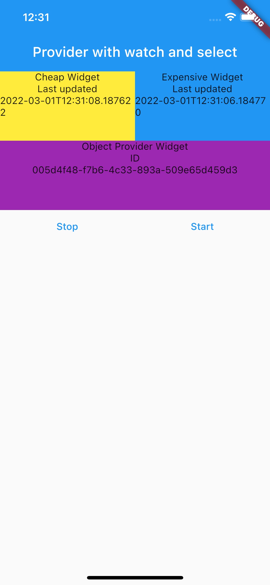

# Example 2 of using Provider

- One is called "cheap" widget and it uses `select()` to render a Container that renders itself when part of our provider changes.
- The other one is "more expensive" and is repainted every 10 seconds, and it also uses `select()`
- the third one is re-rendered using `watch()` and it rerenders itself whenever anything changes in the provider.

- a trick shown in this example is overriding the `notifyListeners()` call to update the `id` of the object whenever the `notifyListeners()` is called. This is shown at [object_provider](lib/provider_app/provider_app_2/object_provider.dart)

## Streams

- the streams will start as soon as the application starts

<!--   -->

  

